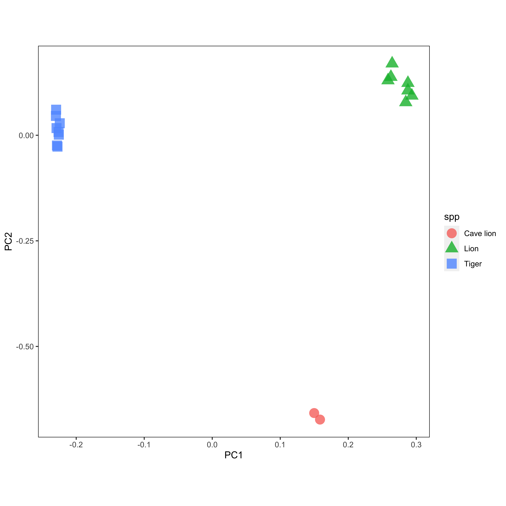
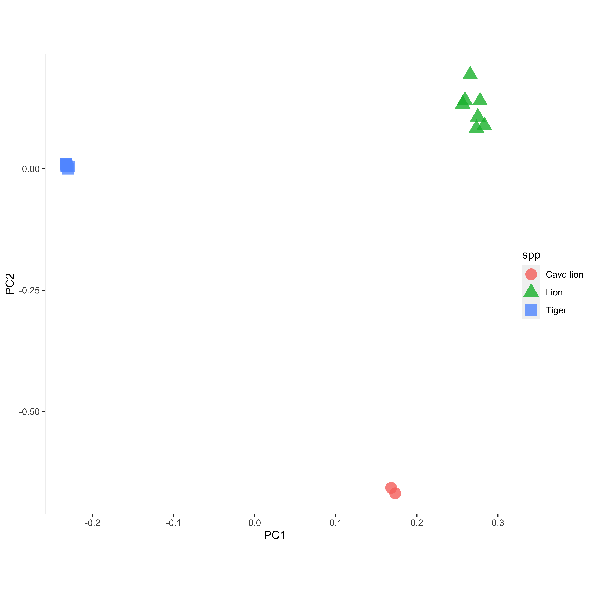

# Pipeline for AIMs identification

### 0. Prep samples
2 cave lions, 7 lions, and 8 tigers were chosen due to the data avability and their phylogentic relationship.

In order to avoid reference bias, domestic cat genome was used (felcat9.0).

Raw data was then processed using paleomix, using `bwa mem` or `bwa aln` for mapping dependent on the sampl quality and age.

Sample meta-information here:
<details>
  <summary>Sample meta information</summary>
  [Sample meta-information](https://docs.google.com/spreadsheets/d/1CMswMdxAq-nw5aDnAL6u-kl7WNeRNOxeQDbLMn4y-pE/edit?usp=sharing)  
</details>

### 1. Genotype calling
#### 1.1 genotype likelihood calling

Genotype likelihood was called using ANGSD and then filtered by `MAF > 0.5` and `Missingness < 0.5`

```
angsd -GL 2 -out ./gl_chr/gl_$CHR -nThreads 2 -doGlf 2 -doMajorMinor 1 -SNP_pval 1e-6 -doMaf 1 -minMapQ 30 -minQ 20 -remove_bads 1 -uniqueOnly 1 -bam $BAM_LIST -r $CHR -checkBamHeaders 0
```

### 2. Create masks
#### 2.1 repeat elements 

Repeat elements annotation from Repeatmasker and Tandem Repeats Finder annotation were download from [UCSC Felcat9.0](http://hgdownload.soe.ucsc.edu/goldenPath/felCat9/bigZips/)


#### 2.2 mappability mask 
Mappability was called genmap.

``` bash
#!/bin/bash

WDIR=/projects/mjolnir1/people/gnr216/3-panthera_aims/0-ref

cd $WDIR

# careful about memory consumption
# /projects/mjolnir1/people/gnr216/a-software/genmap/genmap-build/bin/genmap index -F ./felcat9.fasta -I ./genmap_index


/projects/mjolnir1/people/gnr216/a-software/genmap/genmap-build/bin/genmap map -K 100 -E 2 -I ./genmap_index -O ./genmap_out -t -w -bg -T 20
```

filter by threshold < 1


#### 2.3 numt mask, (blastn)
run blastn against tiger, lion and cave lion mitochondrial sequences
merge the result


|Species|MT used for blastb|
|---|---|
|Cave lion|KX258452.1|
|Tiger|KP202268.1|
|Lion|KP202262.1|


``` bash
# 1. create blastdb
makeblastdb -in ../0-ref/felcat9.fasta -dbtype nucl -out blastdb_felcat9

# 2. run blastn
blastn -db ./blastdb_felcat9/blastdb_felcat9 -query mt.all.fa -out out.blastn.W16E1e-4.mt_all -word_size 16 -evalue 0.0001 -outfmt 7

# 3. clean result
grep -v -e "chrMT" -e "^#" out.blastn.W16E1e-4.mt_all | awk '{print $2,$9,$10}' | awk '$2>$3 {print $1,$3,$2;next}{print $0}' OFS='\t'
 > out.mt_all.hits.bed

# extend 200bp for each segment from both ends
sort -k1,1V -k2,2g out.mt_all.hits.bed | awk '{print $1,$2-200,$3+200}' OFS='\t' | bedtools merge > out.mt_all.hits.f100_merge.bed

```


#### 2.4 ancient DNA mask
Remove transitions


#### 2.5 mask all

``` bash
cat ../0-ref/felcat.rep.trf.bedpos.bed ../5-numt/out.mt_all.hits.f100_merge.bed | sort -k1,1V -k2,2g | bedtools merge > felcat.rep.trf.numt_f100.bedpos.bed

bedtools intersect -a gl_tv_maf05_mis50.bed -b felcat.rep.trf.numt_f100.bedpos.bed -v > gl_tv_maf05_mis50.rep.trf.numt_f100.bed
```

#### 2.6 SNP weight mask (optional)

PCANGSD was used to perform a PCA and get SNP weights for the first (tiger vs lion like) and second PCs (lion vs cave lion).

A relax threshod was applied for SNP weight filter. Check the R script for details.


#### 2.6 SNP distribtuion mask
Randomly take one SNP every 100kbp.  A total of ~23K SNPs left. Randomly take 20K SNPs.
 

### 3. check performance
#### 3.1 PCA

```
pcangsd -e 3 -b ../4-gl/gl_tv_maf05_mis50.fwm_d100k.20k.beagle.gz -o gl_tv_maf05_mis50.fwm_d100k_20k -t 1
```






#### 3.2 Phylogeny

```
ngsDist --pairwise_del --geno ../4-gl/gl_tv_maf05_mis50.fwm_d100k.20k.beagle.gz -out 20k --n_ind 17 --n_sites 20000 --probs --labels ../list.id --n_boot_rep 100
```


### 4. capture data processing
#### 4.1 mapping 

Mapped to the felcat9.0 reference genome using paleomix

#### 4.2 GL calling

``` bash
# prep loci for angsd
awk '{print $3}' SNP.felcat9.column3.20K.bed | sed 's/_/:/' > ../SNP.felcat9.column3.20K.angsd

```

Not enough loci covered by capture result.

#### 4.3 Plan B: only using SNPs with high SNP weight

Identification of 5k SNPs:
 - filterd all variable loci by SNP weight, threshold used 0.6 (relaxed)
 - mask the locis, about 2 mio after mask
 - generate GL/GT_pseudo use the 2 mio panel for the two library, only 5k with information
 - call GL for all samples on the 5k SNPs

**NB:** relaxed filter for data quality


A total of about 5k SNPs retrieved.
Ideally, these 5k SNPs should be a panel of AIMs. We will test it first.
Then, these two new sample (actually one sample with replication) will be projected into the pca or directly integrated.

**NB: two possible bias**  
 - SNP distribution bias, less likely, can be provide by the distribution of SNPs across the genome
 - GL/GT calling bias. The called GT/GL could be biased toward the reference. The distribution of the ref vs alt is extremely skewed. Need to be cautious.

The result looks good. Need to do something to prove the reference bias is acceptable!

#### 4.5 pcangsd

PCA based on 5k SNPs


#### 4.6 phylogeny


